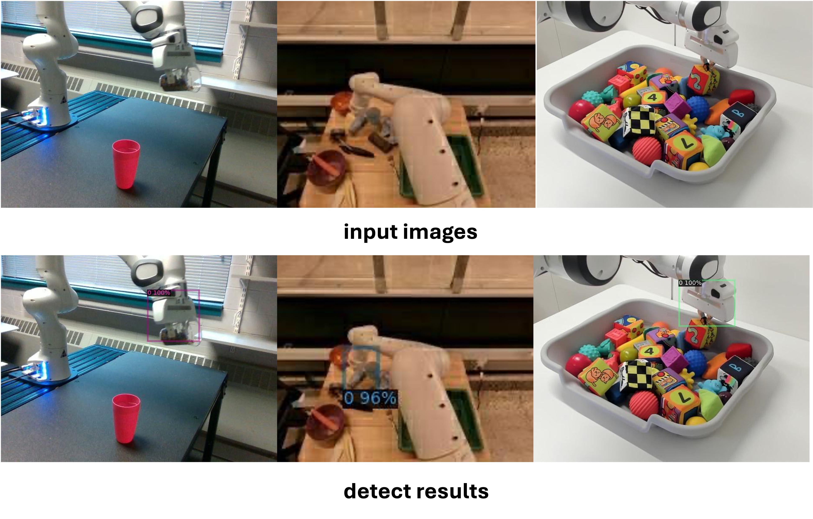

# Gripper_detector

## installation

1. create an environment
```
conda create --name gripper_det python=3.8.1
conda activate gripper_det
git clone https://github.com/Dantong88/Gripper_detector
```
2. install torch
```
pip3 install torch torchvision torchaudio --index-url https://download.pytorch.org/whl/cu124
```

3. install off-the-shelf detectron2
```
python -m pip install 'git+https://github.com/facebookresearch/detectron2.git'
```


## Model
We release the weights of the detector as follows, you are free to download it and
put it under the folder ckpt.

<table><tbody>
<!-- START TABLE -->
<!-- TABLE HEADER -->
<th valign="bottom">Name</th>
<th valign="bottom">Backbone</th>
<th valign="bottom">Train Set</th>
<th valign="bottom">Download</th>
<!-- TABLE BODY -->
<!-- ROW: retinanet_R_50_FPN_1x -->
<tr><td align="left">End-effector Detector</td>
<td align="center">ResNet101</td>
<td align="center"><a href="https://robotics-transformer-x.github.io/">Subset of OXE</a></td>
<td align="center"><a href="https://drive.google.com/file/d/1qQV-yPZHqW9Z_eKR_U0aTnkcKpQ1em9V/view?usp=sharing">Model</a></td>
</tr>
</tbody></table>


## inference
Run inference using our test image:

```angular2html
python inference.py --ckpt ckpt/model_final.pth
```


see parser in ```inference.py``` for complete usage.

<p align="center">  </p>

## How to get support from us?
If you have any general questions, feel free to email us at [Dantong Niu](mailto:bias_88@berkeley.edu)). If you have code or implementation-related questions, please feel free to send emails to us or open an issue in this codebase (We recommend that you open an issue in this codebase, because your questions may help others). 

## Citation
If you find our work inspiring or use our codebase in your research, please consider giving a star ⭐ and a citation.
```
@misc{niu2024llarva,
      title={LLARVA: Vision-Action Instruction Tuning Enhances Robot Learning}, 
      author={Dantong Niu and Yuvan Sharma and Giscard Biamby and Jerome Quenum and Yutong Bai and Baifeng Shi and Trevor Darrell and Roei Herzig},
      year={2024}
}
```